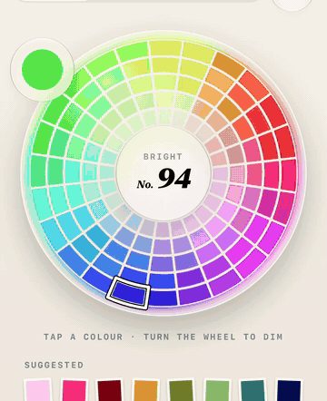
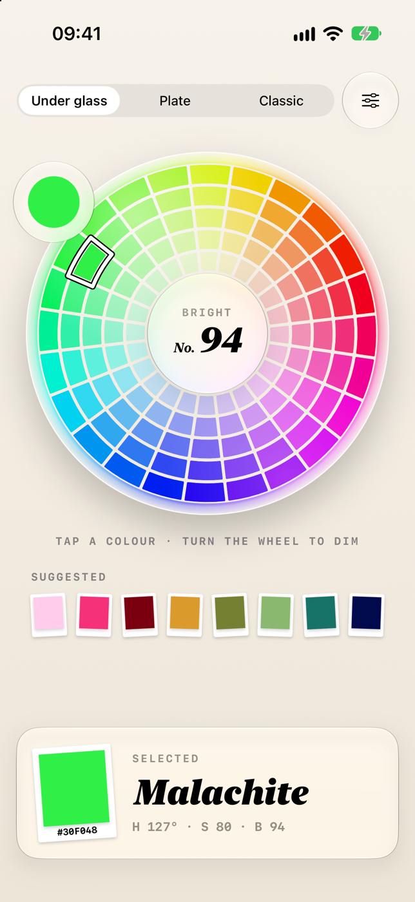
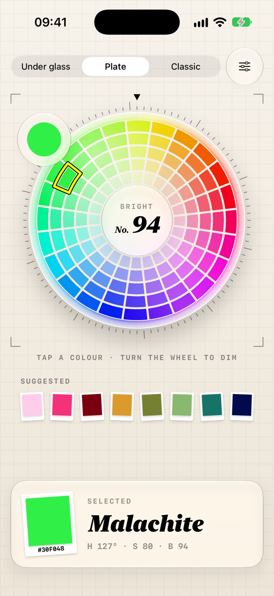
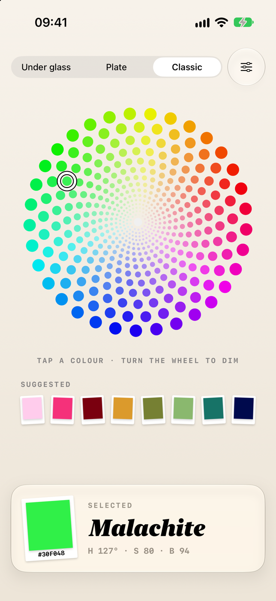

# SwiftColorWheel

[](https://swift.org/package-manager)

A color wheel for SwiftUI. Tap to pick a color, turn the wheel to dim or brighten it.

   

- Two layouts: paper-like **swatches** in rings, or the original **dot** spiral
- Turning the wheel changes brightness, with inertia, rubber-banding and bounce-back like a scroll view
- A glass loupe that magnifies the picked color and stays out of the way
- An optional glass dome (hand-drawn, or Liquid Glass on iOS 26), tick ring and selection ring
- A slot in the center for your own view, such as a brightness readout
- Set the color from code and the wheel spins there
- Haptics and basic VoiceOver support built in

# Requirements

iOS 17, macOS 14 or visionOS 1 and later. Swift 6.

Version 2 is a SwiftUI rewrite. If you need the UIKit `ColorWheel` and `RotatingColorWheel`, or Carthage, stay on the 1.x releases.

# Installation

Add the package in Xcode via **File > Add Package Dependencies…** using

```
https://github.com/dmrschmidt/SwiftColorWheel
```

or add it to your `Package.swift`:

```swift
.package(url: "https://github.com/dmrschmidt/SwiftColorWheel", from: "2.0.0")
```

# Usage

## Quick start

```swift
import SwiftColorWheel
import SwiftUI

struct ColorPickerView: View {
    @State private var color = HSBColor(hue: 0.35, saturation: 0.8, brightness: 0.94)

    var body: some View {
        VStack {
            ColorWheel(selection: $color)
            RoundedRectangle(cornerRadius: 12)
                .fill(color.color)
                .frame(height: 60)
        }
        .padding()
    }
}
```

The wheel is square and uses the smaller side of the space it is given.

## Working with the selection

The wheel binds to an `HSBColor`, a small value type holding hue, saturation and brightness. It converts to and from SwiftUI's `Color`:

```swift
let swiftUIColor = color.color               // HSBColor -> Color
let fromColor = HSBColor(Color.orange)       // Color -> HSBColor
let (red, green, blue) = color.rgb           // sRGB components, 0...1
```

The wheel uses its own type rather than `Color` because black has no hue. With a plain `Color`, a wheel turned all the way down would forget which swatch was picked.

## Setting the color from code

Writing to the binding moves the selection and spins the wheel to the matching brightness. A row of suggested colors is just a few buttons:

```swift
HStack {
    ForEach(suggestions, id: \.self) { suggestion in
        Button {
            color = suggestion
        } label: {
            Circle().fill(suggestion.color).frame(width: 32, height: 32)
        }
    }
}
```

The swatch layout is discrete, so the wheel selects the nearest swatch and writes that color back to the binding.

## Adding a center view

Pass a trailing closure to place your own view in the middle of the wheel. It receives the current color and updates as the wheel turns:

```swift
ColorWheel(selection: $color) { color in
    Text(color.brightness, format: .percent.precision(.fractionLength(0)))
        .font(.title2.bold())
        .monospacedDigit()
}
```

# Customization

## Presets

```swift
ColorWheel(selection: $color, configuration: .underGlass)   // swatches under a glass dome (default)
ColorWheel(selection: $color, configuration: .plate)        // adds a tick ring and a highlighter selection
ColorWheel(selection: $color, configuration: .classic)      // the 1.x dot spiral, without any extras
```

## Configuration

Everything is controlled through `ColorWheelConfiguration`. Start from the default or a preset and change what you need. Optional parts are switched off by setting them to `nil`.

```swift
var configuration = ColorWheelConfiguration()

configuration.selectionRing = .init(color: .highlighter)   // the frame around the picked color
configuration.loupe = nil                                  // hide the magnifier
configuration.dome = .init(glass: .liquid)                 // Liquid Glass instead of the drawn dome
configuration.ticks = .init(count: 100)                    // tick ring turning under a fixed pointer
configuration.showsCenter = false                          // no center view, colors fill the middle
configuration.haptics = false

ColorWheel(selection: $color, configuration: configuration)
```

| Property | Default | Description |
|---|---|---|
| `layout` | `.swatches()` | `.swatches(...)` or `.dots(...)`, see below |
| `selectionRing` | white ring | Frame around the picked color. `nil` hides it |
| `loupe` | 78 pt | Glass magnifier next to the selection. `nil` hides it |
| `dome` | `.drawn` | Glass the wheel sits in. `.drawn` paints a dome over the colors, `.liquid` puts a Liquid Glass plate under them (iOS 26, falls back to `.drawn`). `nil` removes it |
| `ticks` | `nil` | Tick ring and pointer around the wheel |
| `showsCenter` | `true` | Shows the center view. When off, the colors grow inward |
| `showsCenterDisc` | `true` | Glass disc behind the center view |
| `motion` | enabled | Turning behavior, see below |
| `haptics` | `true` | Selection feedback when the picked color changes |

## Layouts

Swatches give you a fixed set of colors: every hue at a few saturation steps.

```swift
configuration.layout = .swatches(.init(
    hues: 24,            // swatches per ring
    rings: 5,            // saturation steps
    innerRadius: 0.36,   // size of the center hole, as a fraction of the radius
    gap: 3,              // spacing between swatches
    cornerRadius: 1
))
```

Dots are the layout from version 1. The options keep their old names:

```swift
configuration.layout = .dots(.init(
    centerRadius: 4,
    minCircleRadius: 1,
    maxCircleRadius: 6,
    innerPadding: 2,
    shiftDegree: 40,     // 0 gives straight rays instead of the spiral
    density: 0.8
))
```

## Motion

One full turn of the wheel covers the whole brightness range. The defaults follow `UIScrollView` where there is an equivalent.

```swift
configuration.motion.isEnabled = false   // tap to pick only, no turning
configuration.motion.friction = 2        // how quickly a free spin slows down
configuration.motion.stiffness = 220     // spring that pulls an overshoot back
configuration.motion.maxOvershoot = 1    // how far past the end it can be dragged, in radians
```

## Inside a scroll view

The wheel handles drags that start on it. If you place it inside a `ScrollView`, leave some space around it so the scroll view can still be dragged.

# Example app

Open `Example/ColorWheelExample.xcodeproj` and run it. It shows the three presets and has a menu to toggle every option. It also contains two small views built on the public API that you can copy into your own project:

- `SuggestedColors`: a row of colors that spin the wheel when tapped
- `SelectionTray`: shows the picked color with a name, hex value and HSB components

# Migrating from 1.x

| 1.x | 2.x |
|---|---|
| `ColorWheel` / `RotatingColorWheel` (UIKit) | `ColorWheel` (SwiftUI). Turning is on by default, disable it with `motion.isEnabled = false` |
| `ColorWheelDelegate.didSelect(color:)` | `selection` binding, or `.onChange(of: color)` |
| `padding`, `centerRadius`, `shiftDegree`, ... | Same names on `ColorWheelLayout.Dots` |
| `highlightStrokeColor` | `selectionRing.color` |
| `brightness` | `selection.brightness` |

# More related iOS Controls

You may also find the following iOS controls written in Swift interesting:

* [DSWaveformImage](https://github.com/dmrschmidt/DSWaveformImage) - draw an audio file's waveform image
* [QRCode](https://github.com/dmrschmidt/QRCode) - a customizable QR code generator

Also [check it out on CocoaControls](https://www.cocoacontrols.com/controls/swiftcolorwheel).

If you really like this library (aka Sponsoring)
------------
I'm doing all this for fun and joy and because I strongly believe in the power of open source. On the off-chance though, that using my library has brought joy to you and you just feel like saying "thank you", I would smile like a 4-year old getting a huge ice cream cone, if you'd support my via one of the sponsoring buttons ☺️💕

If you're feeling in the mood of sending someone else a lovely gesture of appreciation, maybe check out my iOS app [💌 SoundCard](https://www.soundcard.io) to send them a real postcard with a personal audio message.

<a href="https://www.buymeacoffee.com/dmrschmidt" target="_blank"></a>


## See it live in action

[SoundCard - postcards with sound](https://www.soundcard.io) lets you send real, physical postcards with audio messages. Right from your iOS device.

SwiftColorWheel is used to color the waveform derived from the audio message on postcards sent by [SoundCard - postcards with audio](https://www.soundcard.io).

&nbsp;

<div align="center">
    <a href="http://bit.ly/soundcardio">
        
        
Download SoundCard on the App Store.
    </a>
</div>

&nbsp;

<a href="http://bit.ly/soundcardio">

</a>
